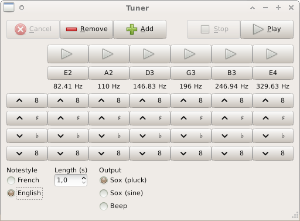

Tuner
=====

Tuner is a python application that can be used to tune a music instrument. It defaults to a guitar standard tuning, but I guess you could use it for any instrument.

Tuner just emits sounds. It does not process the soundcard input to assess the tuning. To do that, you should look at greater applications such as [guitarix](https://sourceforge.net/projects/guitarix/files/gxtuner/) or [Lingot](http://www.nongnu.org/lingot/).

Tuner does not aim at being actually useful. I wrote it as an exercise to learn python and GTK. I use it. Sometimes.



## Features

Playback through internal speaker or via soundcard output.

Configurable key set:

* Keys can be added or removed.
* Key-wise or global pitch adjustment, by semitone or octave step.

Single note or all-notes-in-a-row playback.

Adjustable note length.

English (A, B C, D, E, F) and French (Do, Ré, Mi, Fa, Sol, La, Si) notestyles support.

I18n : English and French supported. Translations welcome.

## License

It is distributed under the terms of the beer-ware licence:

> As long as you retain this notice you can do whatever you want with this stuff. If we meet some day, and you think this stuff is worth it, you can buy me a beer in return.

## Dependencies

Tuner runs on linux and depends on:

* [Python](https://www.python.org/) 2.7. (It may work with 2.4+).
* [PyGObject](https://wiki.gnome.org/action/show/Projects/PyGObject) 3.0+ (python-gi).
* One of the two supported backends:
  * [beep](https://github.com/johnath/beep) >= [e1320c1](https://github.com/johnath/beep/commits/e1320c1da52ca92aa68b4224f9532982184fbe00) for the internal speaker playback.
  * [sox](http://sox.sourceforge.net/) for the soundcard output.

## Usage

```
chmod +x tuner.py
tuner.py
```
